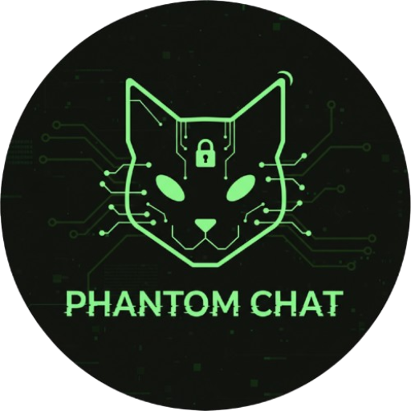

<p align="center">
  
</p>

<h1 align="center">Phantom Chat</h1>

<p align="center">
  <strong>Self-destructing encrypted chat rooms with military-grade security</strong>
</p>

<p align="center">
  <a href="#features">Features</a> •
  <a href="#tech-stack">Tech Stack</a> •
  <a href="#getting-started">Getting Started</a> •
  <a href="#architecture">Architecture</a> •
  <a href="#security">Security</a> •
  <a href="#deployment">Deployment</a>
</p>

<p align="center">
  
  
  
  
  
</p>

---

## 🎯 About

**Phantom Chat** is a secure, ephemeral messaging platform that prioritizes privacy above all else. Create a chat room, share the link, and communicate with complete confidence that your messages will vanish without a trace.

- **No accounts required** - Start chatting instantly
- **End-to-end encrypted** - Messages encrypted in your browser
- **Self-destructing** - Rooms automatically delete after TTL expires
- **Zero-knowledge** - We can't read your messages, even if we wanted to

---

## ✨ Features

### 🔐 Security First
| Feature | Description |
|---------|-------------|
| **AES-256-GCM** | Military-grade symmetric encryption |
| **ECDH Key Exchange** | Secure key negotiation using P-256 curve |
| **Zero-Knowledge** | Server never sees plaintext or encryption keys |
| **No Logs** | No IP addresses or metadata stored |

### 💬 Chat Features
| Feature | Description |
|---------|-------------|
| **Real-time Messaging** | Instant message delivery via WebSockets |
| **2-Person Rooms** | Private conversations between two people |
| **TTL Countdown** | Visual timer showing room lifetime |
| **Manual Destruction** | Destroy room instantly at any time |

### 🎨 User Experience
| Feature | Description |
|---------|-------------|
| **Cyberpunk UI** | Dark theme with Matrix-inspired aesthetics |
| **Responsive Design** | Works on desktop, tablet, and mobile |
| **No Installation** | Works in any modern browser |
| **Accessible** | WCAG AA compliant |

---

## 🛠 Tech Stack

### Frontend
- **[Next.js 16](https://nextjs.org/)** - React framework with App Router
- **[TypeScript](https://www.typescriptlang.org/)** - Type-safe JavaScript
- **[Tailwind CSS 4](https://tailwindcss.com/)** - Utility-first CSS
- **[TanStack Query](https://tanstack.com/query)** - Server state management
- **[GSAP](https://greensock.com/gsap/)** - Animations
- **[Lucide Icons](https://lucide.dev/)** - Beautiful icons

### Backend
- **[Elysia](https://elysiajs.com/)** - Fast TypeScript server framework
- **[Upstash Redis](https://upstash.com/)** - Serverless Redis database
- **[Upstash Realtime](https://upstash.com/)** - WebSocket connections

### Security
- **[Web Crypto API](https://developer.mozilla.org/en-US/docs/Web/API/Web_Crypto_API)** - Browser-native cryptography
- **AES-256-GCM** - Symmetric encryption
- **ECDH P-256** - Key exchange

---

## 🚀 Getting Started

### Prerequisites

- **Node.js** 18+
- **pnpm** (recommended) or npm
- **Upstash** account (Redis + Realtime)

### Installation

1. **Clone the repository**
```bash
git clone https://github.com/yourusername/phantom-chat.git
cd phantom-chat
```

2. **Install dependencies**
```bash
pnpm install
```

3. **Set up environment variables**
```bash
cp .env.example .env.local
```

Edit `.env.local` with your credentials:
```env
# Upstash Redis
UPSTASH_REDIS_REST_URL=your_redis_url
UPSTASH_REDIS_REST_TOKEN=your_redis_token

# Upstash Realtime
UPSTASH_REALTIME_URL=your_realtime_url
UPSTASH_REALTIME_TOKEN=your_realtime_token

# App URL (for metadata)
NEXT_PUBLIC_APP_URL=http://localhost:3000
```

4. **Run the development server**
```bash
pnpm dev
```

5. **Open your browser**
```
http://localhost:3000
```

---

## 🏗 Architecture

### Project Structure

```
phantom-chat/
├── app/                    # Next.js App Router
│   ├── api/               # API routes (Elysia)
│   ├── chat/              # Info pages (FAQ, Guide, etc.)
│   ├── create/            # Room creation page
│   ├── room/[roomId]/     # Chat room page
│   ├── legal/             # Legal pages
│   └── layout.tsx         # Root layout
├── components/
│   ├── landing/           # Landing page components
│   └── ui/                # Shared UI components
├── hooks/
│   ├── fetch/             # API hooks (TanStack Query)
│   └── use-*.ts           # Custom hooks
├── lib/
│   ├── landing/           # Landing page constants
│   ├── realtime-setup/    # Realtime client config
│   └── redis-setup/       # Redis client config
├── providers/             # React context providers
└── public/                # Static assets
```

### Data Flow

```
┌─────────────┐     ┌─────────────┐     ┌─────────────┐
│   Browser   │────▶│  Next.js    │────▶│   Upstash   │
│  (Encrypt)  │◀────│   API       │◀────│   Redis     │
└─────────────┘     └─────────────┘     └─────────────┘
       │                                       │
       │            ┌─────────────┐            │
       └───────────▶│  Realtime   │◀───────────┘
                    │  WebSocket  │
                    └─────────────┘
```

### Encryption Flow

```
User A                          Server                          User B
  │                               │                               │
  │  1. Generate ECDH keypair     │                               │
  │─────────────────────────────▶ │                               │
  │     Send public key           │                               │
  │                               │  2. Store public key          │
  │                               │                               │
  │                               │  3. Generate ECDH keypair     │
  │                               │ ◀─────────────────────────────│
  │                               │     Send public key           │
  │                               │                               │
  │  4. Receive B's public key    │                               │
  │◀───────────────────────────── │ ─────────────────────────────▶│
  │                               │  4. Receive A's public key    │
  │                               │                               │
  │  5. Derive shared secret      │     5. Derive shared secret   │
  │     (ECDH)                    │        (ECDH)                 │
  │                               │                               │
  │  6. Encrypt message           │                               │
  │     (AES-256-GCM)             │                               │
  │─────────────────────────────▶ │ ─────────────────────────────▶│
  │     Send ciphertext           │     Forward ciphertext        │
  │                               │                               │
  │                               │     7. Decrypt message        │
  │                               │        (AES-256-GCM)          │
```

---

## 🔒 Security

### Encryption Specifications

| Component | Specification |
|-----------|---------------|
| Symmetric Encryption | AES-256-GCM |
| Key Exchange | ECDH with P-256 curve |
| Key Derivation | HKDF-SHA256 |
| IV Size | 96 bits (unique per message) |
| Auth Tag | 128 bits |

### What We CAN'T See

- ❌ Message contents (encrypted client-side)
- ❌ Encryption keys (generated client-side)
- ❌ User identities (no accounts)
- ❌ IP addresses (not logged)

### What We Store (Temporarily)

- ✅ Encrypted messages (ciphertext only)
- ✅ Public keys (for key exchange)
- ✅ Room metadata (creation time, TTL)
- ✅ Anonymous session tokens

### Data Retention

All data is automatically deleted:
- When TTL expires (countdown timer)
- When room is manually destroyed
- No backups are kept

---

## 📦 Deployment

### Vercel (Recommended)

1. **Push to GitHub**
```bash
git push origin main
```

2. **Import to Vercel**
- Go to [vercel.com](https://vercel.com)
- Import your repository
- Add environment variables
- Deploy

3. **Environment Variables**
Add these in Vercel dashboard:
```
UPSTASH_REDIS_REST_URL
UPSTASH_REDIS_REST_TOKEN
UPSTASH_REALTIME_URL
UPSTASH_REALTIME_TOKEN
NEXT_PUBLIC_APP_URL
```

### Docker

```dockerfile
FROM node:18-alpine AS builder
WORKDIR /app
COPY package.json pnpm-lock.yaml ./
RUN npm install -g pnpm && pnpm install
COPY . .
RUN pnpm build

FROM node:18-alpine AS runner
WORKDIR /app
COPY --from=builder /app/.next/standalone ./
COPY --from=builder /app/.next/static ./.next/static
COPY --from=builder /app/public ./public
EXPOSE 3000
CMD ["node", "server.js"]
```

---

## 📚 Documentation

| Page | Description |
|------|-------------|
| [/chat/faq](/chat/faq) | Frequently Asked Questions |
| [/chat/guide](/chat/guide) | User Guide |
| [/chat/security](/chat/security) | Security Overview |
| [/chat/encryption](/chat/encryption) | Encryption Deep Dive |

---

## 🤝 Contributing

Contributions are welcome! Please read our contributing guidelines before submitting a PR.

1. Fork the repository
2. Create your feature branch (`git checkout -b feature/amazing-feature`)
3. Commit your changes (`git commit -m 'Add amazing feature'`)
4. Push to the branch (`git push origin feature/amazing-feature`)
5. Open a Pull Request

---

## 📄 License

This project is licensed under the MIT License - see the [LICENSE](LICENSE) file for details.

---

## 🙏 Acknowledgments

- [Upstash](https://upstash.com/) for serverless Redis and Realtime
- [Vercel](https://vercel.com/) for hosting
- [Tailwind CSS](https://tailwindcss.com/) for styling
- [Lucide](https://lucide.dev/) for icons

---

<p align="center">
  <strong>Built with privacy in mind.</strong>
  <br />
  <sub>No accounts. No logs. No traces.</sub>
</p>

<p align="center">
  
</p>
